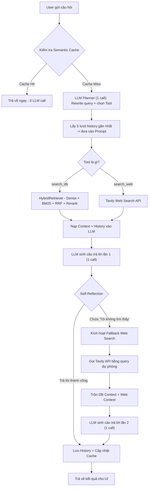

# Kiến trúc & Luồng hoạt động của HCMUT RAG Agent

Tài liệu này mô tả chi tiết cơ chế hoạt động của Agent tư vấn tuyển sinh Đại học Bách Khoa TP.HCM (HCMUT).

Hệ thống sử dụng kiến trúc **Agentic RAG**, kết hợp giữa 2 mô hình thiết kế là **Plan-and-Execute** (Lên kế hoạch và Thực thi) và **Self-Reflection** (Tự đánh giá). Tính năng mới nhất bổ sung **Context-Aware History** (Quản lý lịch sử hội thoại) và **Semantic Cache** được tích hợp vào Agent.

---

## 1. Luồng Tổng Quan (The Flow)

Mỗi khi người dùng đặt một câu hỏi, Agent sẽ lần lượt đi qua các bước sau:

### Bước 0: Kiểm tra Semantic Cache
- **Input:** Câu hỏi thô của người dùng.
- **Process:** Agent kiểm tra xem câu hỏi này (hoặc câu hỏi ngữ nghĩa gần giống) đã được trả lời trước đó chưa bằng kiến trúc 2 tầng: Exact Match -> Vector Search -> Cross-Encoder Rerank.
- **Output:** Nếu có (**Cache Hit**): trả lời ngay lập tức, **0 LLM API call**. Kết thúc luồng.

### Bước 1: Lập kế hoạch & Viết lại Query (Planning + Rewrite, 1 LLM call)
- **Input:** Câu hỏi gốc + **5 lượt lịch sử hội thoại gần nhất** (nếu có).
- **Process:** Một LLM call duy nhất thực hiện 3 nhiệm vụ đồng thời:
  1. Đọc lịch sử, hiểu ngữ cảnh (VD: "nó" là ngành nào từ lượt hỏi trước).
  2. Viết lại câu hỏi thành câu hoàn chỉnh, đầy đủ ngữ cảnh (`rewritten_query`).
  3. Chọn công cụ phù hợp và chuẩn bị query cho công cụ đó (`primary_action`, `fallback_action`).
- **Output (JSON):** `thought`, `rewritten_query`, `primary_action`, `fallback_action`.
- **Mục tiêu:** Gom 2 bước (Rewrite + Plan) thành **1 LLM call**, tiết kiệm 1 call API.

### Bước 2: Thực thi Tool chính (Primary Execution)
- Hệ thống bóc tách `primary_action` và gọi hàm tương ứng.
- **Nếu là `search_db`:** Gọi HybridRetriever (Dense + BM25 + RRF + Reranker). Hoạt động hoàn toàn Local, không tốn API call.
- **Nếu là `search_web`:** Gọi thẳng Tavily API để cào dữ liệu từ Internet.

### Bước 3: Sinh câu trả lời lần 1 & Chặn Ảo giác (1st Generation, 1 LLM call)
- Hệ thống đẩy `contexts` + `rewritten_query` + **lịch sử hội thoại** vào prompt.
- Prompt có luật ép cứng: *"Chỉ sử dụng thông tin tham khảo. Nếu không có, bắt buộc phải trả lời: 'Tôi không tìm thấy...'."*
- Nếu có đủ thông tin: trả lời ngay. **Kết thúc luồng!** (tổng 2 LLM calls).

### Bước 4: Tự Kiểm Điểm & Kích Hoạt Dự Phòng (Self-Reflection & Fallback)
- Nếu câu trả lời có chứa chuỗi *"không tìm thấy"*, hệ thống kích hoạt `fallback_action` (thường là `search_web`).
- Thêm keyword an toàn *"Đại học Bách Khoa TP.HCM"* vào query để chống đi lạc chủ đề.

### Bước 5: Cào Dữ Liệu Web (Tavily Web Search)
- Gọi Tavily API với cờ `search_depth="basic"` và `include_answer="basic"`.
- Kết quả bao gồm câu trả lời tóm tắt và nội dung từ 3 bài viết uy tín nhất.
- Nối các context web vào context DB để tạo thành kho tư liệu hỗn hợp.

### Bước 6: Tổng Hợp Chốt Hạ (2nd Generation, 1 LLM call nữa)
- Nạp lại toàn bộ kho tư liệu (DB + Web) + lịch sử vào Prompt.
- LLM sinh câu trả lời lần 2 với đầy đủ thông tin.

### Bước 7: Lưu History & Cập nhật Cache
- Sau khi có câu trả lời cuối, hệ thống tự động:
  - Lưu lượt hỏi này vào `history.py` (được dùng lại ở lượt sau).
  - Cập nhật `SemanticCache` bất đồng bộ (không block UI).

---

## 2. Ưu Điểm Của Kiến Trúc Này

1. **Zero-Extra-Cost History:** Viết lại câu hỏi và lập kế hoạch được gộp vào **1 LLM call**, không tốn thêm API call nào để quản lý lịch sử.
2. **Siêu chính xác (High Accuracy):** Dùng chính LLM để đánh giá kết quả (Self-Reflection), khắc phục điểm mù của Reranker.
3. **An toàn (Safe Bounds):** Luật ép trong prompt đảm bảo bot không trả lời các câu hỏi ngoài phạm vi tuyển sinh Bách Khoa.
4. **Tiết kiệm API (API-efficient):** Semantic Cache trả về ngay lập tức với 0 LLM call cho câu hỏi trùng lặp.
5. **Kháng lỗi (Robust):** Tất cả các điểm gọi API (Planner, Generator, Tavily) đều có `try/except`, đảm bảo bot không crash khi mạng lỗi.
6. **Mượt mà về UI:** Phần `thought` và `rewritten_query` được hiển thị trên Streamlit, người dùng thấy được Agent đang suy luận gì và hiểu câu hỏi như thế nào.

---

## 3. Sơ Đồ Luồng (Flowchart)

---

## 4. Cách Hiện Thực (Implementation Details)

1. **Schema Định nghĩa LLM Output (Pydantic):**
   - `Plan` chứa `thought`, `rewritten_query`, `primary_action`, `fallback_action`.
   - Thêm `rewritten_query` giúp Agent hiểu ngữ cảnh lịch sử mà không cần thêm LLM call.

2. **History Management:**
   - Agent tự đọc từ `rag.chat.history.get_history()`, lấy `history[-5:]`.
   - Sau khi trả lời, `add_turn()` lưu lượt này lại vào history.
   - History được inject vào cả prompt Planning lẫn prompt Generation.

3. **Semantic Cache tích hợp vào Agent:**
   - Được kiểm tra ngay ở đầu hàm `run()`, trước khi gọi bất kỳ API nào.
   - Cache được cập nhật bất đồng bộ sau khi trả lời (không block UI).

4. **Cơ Chế Self-Reflection (Tự phản tỉnh):**
   - System Prompt ép cứng luật - Nếu thiếu thông tin, bắt buộc in ra chuỗi *"Tôi không tìm thấy..."* (Tạo cờ hiệu).
   - Agent code bắt cờ hiệu này bằng lệnh `if "không tìm thấy" in answer.lower():` để tự động kích hoạt ngầm lệnh tìm Web.

5. **Kháng lỗi (Robustness):**
   - `_plan()`, `_generate()`, `_tool_search_web()` đều có `try/except`.
   - Nếu Tavily API lỗi: fallback trả lời bằng context DB hiện có.
   - Nếu Planner lỗi: trả về thông báo lỗi an toàn.

6. **Tích hợp giao diện UI suy luận (Streamlit):**
   - Hiển thị `thought` trong `st.status("Suy nghĩ xong")`.
   - Hiển thị `rewritten_query` (nếu khác query gốc) bằng `st.info()` để User biết Agent đã hiểu ngữ cảnh.

---

## 5. Phân Tích Chi Phí & Số Lượng API Calls (Operational Metrics)

| Kịch bản | LLM Calls | Embedding Calls | Tavily Calls | Tổng |
| :--- | :---: | :---: | :---: | :---: |
| **Cache Hit (Tối ưu nhất)** | **0** | 1 | 0 | **1** |
| **Bình thường (DB có đáp án)** | **2** | 1 | 0 | **3** |
| **Xấu nhất (Fallback Web)** | **3** | 1 | 1 | **4** |

> **Kết luận:** Giới hạn 15 RPM cho phép người dùng hỏi **5 câu/phút** ở kịch bản xấu nhất và **7 câu/phút** ở kịch bản bình thường. Đây là mức an toàn cao cho sử dụng cá nhân.
